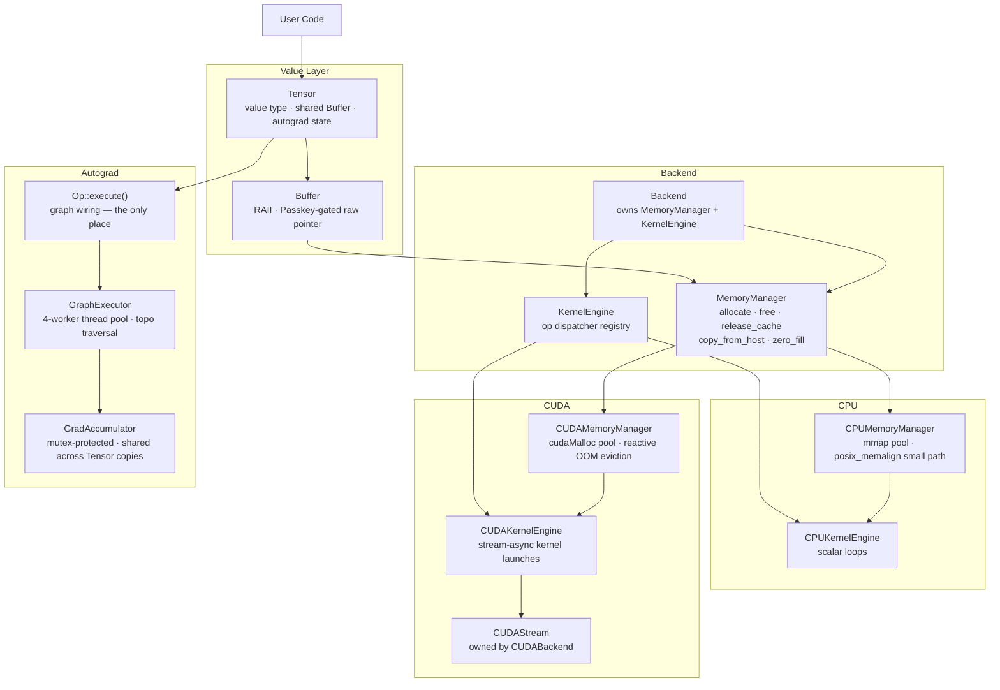

# OTTER


Otter is a C++ autodiff library. It computes reverse-mode gradients over a computation graph built at runtime, dispatches kernels through a pluggable backend layer, and installs as a CMake static library. CPU and CUDA backends are both supported.

```cpp
#include "otter/tensor.h"
#include "otter/backends/cpu.h"
#include "otter/optim/sgd.h"

otter::Backend& be = otter::cpu_backend();

// Dataset
otter::Tensor x = otter::Tensor::from_data<double>({0.1,0.2, 0.3,0.4, 0.5,0.6, 0.7,0.8}, {4,2}, be);
otter::Tensor y = otter::Tensor::from_data<double>({0.3, 0.7, 1.1, 1.5}, {4,1}, be);

// Weights
otter::Tensor W1 = otter::Tensor::zeros({2,4}, be, otter::DType::Float64, /*requires_grad=*/true);
otter::Tensor b1 = otter::Tensor::zeros({4},   be, otter::DType::Float64, /*requires_grad=*/true);
otter::Tensor W2 = otter::Tensor::zeros({4,1}, be, otter::DType::Float64, /*requires_grad=*/true);
otter::Tensor b2 = otter::Tensor::zeros({1},   be, otter::DType::Float64, /*requires_grad=*/true);

otter::optim::SGD sgd({W1, b1, W2, b2}, /*lr=*/0.01);

for (int step = 0; step < 100; ++step) {
    sgd.zero_grad();

    otter::Tensor h   = x.matmul(W1).add(b1.broadcast_to({4,4})).relu();
    otter::Tensor out = h.matmul(W2).add(b2.broadcast_to({4,1}));
    otter::Tensor mse = out.sub(y).mul(out.sub(y)).mean();

    mse.backward();
    sgd.step();
}
```

The forward pass traces a computation graph. `.backward()` traverses it in reverse topological order and accumulates `∂loss/∂param` into every leaf tensor marked `requires_grad=true`. The graph is freed after each pass unless `retain_graph=true` is set.

---

## Architecture



---

## Tensor ops

```
Binary:           add  sub  mul  div
Unary:            neg  exp  log  sqrt  relu
Matmul:           matmul  (batched; batch dims accept stride-0 broadcast views)
Reductions:       sum  mean
Views (diffable): reshape  transpose  slice  broadcast_to
Layout:           view  contiguous
```

All binary, unary, matmul, and reduction ops participate in the graph. View ops wire a backward node that routes gradients back through the layout change. `view`, `contiguous`, and `fill_` are not differentiable.

---

## Autograd

```cpp
otter::Tensor a = otter::Tensor::from_data<double>({1.0, 2.0, 3.0}, {3}, be,
                                                   /*requires_grad=*/true);
otter::Tensor loss = a.mul(a).sum();   // loss = Σaᵢ²
loss.backward();
// a.grad() == [2.0, 4.0, 6.0]   (∂loss/∂aᵢ = 2aᵢ)
```

- `retain_graph=true` keeps the graph intact for a second backward call
- `detach()` returns a shallow copy with no grad history; the buffer is shared
- `NoGradGuard` disables graph construction — used internally by all backward passes and optimizer steps
- Gradients accumulate across `backward()` calls; call `zero_grad()` to reset before the next pass

---

## Optimizer

SGD with optional momentum and weight decay:

```cpp
// Basic
otter::optim::SGD sgd({W, b}, /*lr=*/0.01);

// With momentum
otter::optim::SGD sgd({W, b}, /*lr=*/0.01, /*momentum=*/0.9);

// With weight decay
otter::optim::SGD sgd({W, b}, /*lr=*/0.01, /*momentum=*/0.0, /*weight_decay=*/1e-4);
```

Parameters are passed by value. The optimizer shares the same `Buffer` as the caller's tensors — `step()` updates are visible through the original handles immediately. `set_lr(double)` adjusts the learning rate between steps.

---

## CUDA backend

```cpp
#include "otter/backends/cuda.h"

otter::Backend& cuda = otter::cuda_backend();

otter::Tensor d = otter::Tensor::from_data<double>({1.0, 2.0, 3.0}, {3}, cuda);
d.fill_(5.0);

// Move between devices
otter::Tensor host = d.cpu();
otter::Tensor back = host.cuda();
```

`cuda_backend()` allocates via `cudaMalloc` (device memory). `Tensor::cuda()` and `Tensor::cpu()` copy data across devices in one `cudaMemcpy` call. Non-contiguous CUDA tensors must be made contiguous before moving to CPU.

Kernels launch asynchronously on a non-default `cudaStream_t` owned by the backend. The host does not stall after each kernel. Synchronization occurs at graph boundaries only: once per backward pass (after all workers drain, before gradient buffers are freed) and once per host read (`at()` / `to_vector()`). This eliminates the per-kernel `cudaStreamSynchronize` that was the dominant latency in training loops.

Double-precision atomic accumulations (used by `sum` and `reduce_to`) use a portable CAS loop that works on SM 2.0+. Hardware `atomicAdd(double*)` (SM 6.0+) is not required.

The CUDA memory manager maintains a pool allocator (`free_pool_` multimap, 2 MB minimum segment). Freed large buffers return to the pool and are reused on the next allocation of equal or smaller size. On `cudaErrorMemoryAllocation`, the allocator drains the entire pool, synchronizes the device, and retries before throwing `std::bad_alloc` — so an allocation that fails while cached segments exist will succeed after eviction rather than crash. `release_cache()` returns all pooled memory to the driver explicitly.

---

## Thread safety

`grad()`, `zero_grad()`, and `accumulate_grad()` are mutex-protected via `GradAccumulator::mtx`. Concurrent reads and writes on the same leaf's gradient are safe from any thread.

Concurrent `backward()` calls on separate computation graphs that share a leaf weight are safe. The canonical data-parallel pattern — N threads each computing loss and calling `backward()`, one shared weight tensor — works without external synchronization on both CPU and CUDA.

`backward()` is driven by `GraphExecutor`, a singleton dep-count ready-queue engine with a 4-worker thread pool. Independent nodes in the computation graph execute in parallel; gradient accumulation into a shared leaf is serialized by `GradAccumulator::mtx`. One backward pass runs at a time (`run_mtx_`); a second call to `backward()` blocks until the first completes. On CUDA, the backend stream is flushed at the end of each pass before any gradient buffers are released.

`SGD::step()` is not safe for concurrent calls on the same optimizer. `dispatch_scale` and `dispatch_axpy` write directly into parameter and velocity buffers. Call `step()` from one thread after all backward passes have joined.

---

## Design notes

`Tensor` is a value type. Copies share one `Buffer` via `shared_ptr` with independent shape, stride, and offset metadata. Views are zero-copy; `contiguous()` copies only when the strides are non-standard.

`Backend` owns a `MemoryManager` and a `KernelEngine`. `cpu_backend()` and `cuda_backend()` are program-lifetime singletons. Tensors bind to a backend at creation. Two tensors are on the same device iff their backend pointers are equal.

`KernelEngine` is a dispatcher registry. Each op family registers a typed `Dispatcher` struct in the backend constructor. Adding a kernel means adding a dispatcher and a `KernelType` entry; the registry interface does not change. The CPU and CUDA engines register independently — an op missing from CUDA throws a `std::runtime_error` with the exact dispatcher name, rather than silently falling back.

`Buffer::data()` requires `Passkey<KernelEngine>`. Only `KernelEngine` subclasses can construct the passkey. Every raw-pointer access site is auditable with `grep Passkey<KernelEngine>`.

`Operation::execute()` owns all graph wiring. `forward()` and `backward()` are pure compute. Leaf tensors get `grad_accum_` at creation; computed tensors get `grad_op_` set by `execute()` and nulled after backward unless `retain_graph=true`.

Execution is eager. `execute()` dispatches each kernel immediately and returns a materialized `Tensor`; the backward pass reifies a full schedule — topological order plus a dependency-count DAG — before running, but each gradient op still executes its kernels eagerly. An optional lazy, compiled path — graph capture, kernel fusion, and per-backend code generation (JIT) — is the next major architectural direction. It is not yet implemented; see [#6](https://github.com/Bhavikupadhyay/otter/issues/6).

---

## Debug utilities

`include/otter/debug.h` provides header-only utilities over the public Tensor API:

```cpp
#include "otter/debug.h"

otter::has_nan(t);              // bool
otter::has_inf(t);              // bool
otter::max_abs_diff(a, b);      // double
otter::shape_str(t);            // "[2, 3]"
otter::dtype_str(t);            // "Float64"
t.print("label");               // shape, dtype, values to stdout
t.to_vector<double>();          // host-side copy in logical row-major order
```

---

## Build

### CPU only

```bash
cmake -B build/debug   -GNinja -DCMAKE_BUILD_TYPE=Debug
cmake -B build/release -GNinja -DCMAKE_BUILD_TYPE=Release
cmake --build build/debug
cmake --build build/release
./build/debug/tests/otter_cpu_tests
./build/release/tests/otter_cpu_tests
```

### With CUDA

Requires NVIDIA GPU and CUDA toolkit 11.2+.

```bash
cmake -B build/cuda/debug -GNinja -DCMAKE_BUILD_TYPE=Debug \
      -DOTTER_CUDA=ON \
      -DCMAKE_CUDA_COMPILER=/usr/local/cuda/bin/nvcc \
      -DCMAKE_CUDA_ARCHITECTURES=native

cmake -B build/cuda/release -GNinja -DCMAKE_BUILD_TYPE=Release \
      -DOTTER_CUDA=ON \
      -DCMAKE_CUDA_COMPILER=/usr/local/cuda/bin/nvcc \
      -DCMAKE_CUDA_ARCHITECTURES=native

cmake --build build/cuda/debug
cmake --build build/cuda/release

./build/cuda/debug/tests/otter_cpu_tests
./build/cuda/debug/tests/otter_cuda_tests
./build/cuda/debug/tests/otter_cross_tests
```

`/usr/local/cuda/bin/nvcc` is a symlink to whatever toolkit version is installed. Replace `native` with a specific SM number (e.g. `86` for Ampere, `89` for Ada) when cross-compiling or targeting CI hardware. Pass the full versioned path (e.g. `/usr/local/cuda-12.5/bin/nvcc`) if multiple toolkit versions are installed.

Debug builds enable `-fsanitize=address,undefined` on CPU only; ASan is incompatible with the CUDA runtime and is disabled automatically when `-DOTTER_CUDA=ON` is set. Both builds compile with `-Wall -Wextra -Werror` scoped to C++ only.

### Requirements

- C++17 compiler (GCC 9+ or Clang 10+)
- CMake 3.20+
- Ninja (optional, faster builds)
- Linux or macOS for CPU builds (`mmap` and `posix_memalign` required)
- CUDA toolkit 11.2+ and an NVIDIA GPU for `-DOTTER_CUDA=ON`

---

## License

Apache 2.0 — see [LICENSE](LICENSE).

Copyright 2026 Bhavik Kethan Upadhyay
